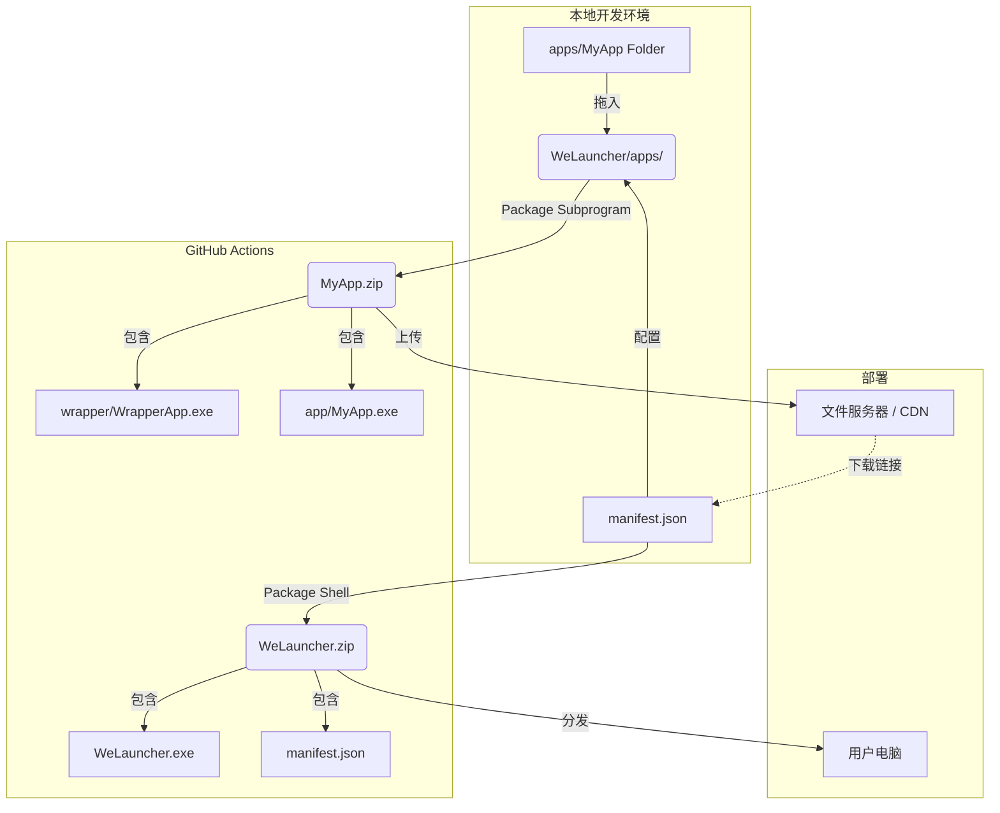
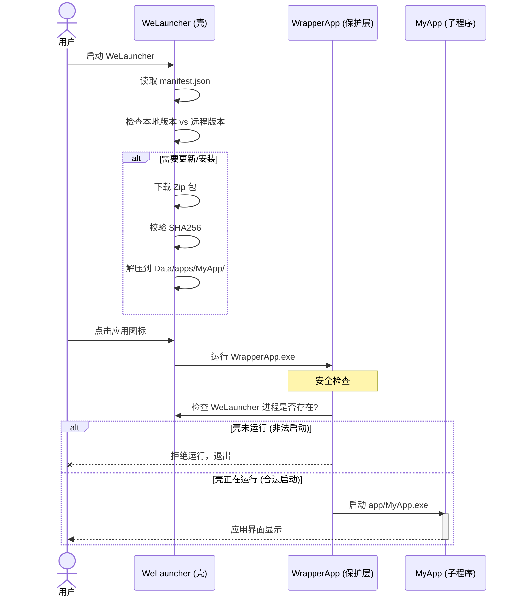

# WeLauncher

WeLauncher 是一个简化的 Windows 原生 Launcher（C# + WPF），核心目标是：**简单、有效、安全**。

它只做三件事：
1.  **壳 (Shell)**：管理应用列表，负责自身的更新。
2.  **分发 (Distribution)**：下载、校验、解压应用包。
3.  **保护 (Protection)**：通过 Wrapper 确保子程序只能由壳启动。

---

## 流程全景图 (Workflow)

### 1. 开发与打包流程 (Build & Package)

开发者只需将子程序放入 `apps` 目录，然后通过 GitHub Actions 一键打包。



### 2. 用户运行流程 (Runtime)

用户启动 WeLauncher 后，壳会自动处理一切。Wrapper 会拦截非法的直接启动。



---

## UI 状态与交互 (UI & Interaction)

WeLauncher 在运行时会展示清晰的状态反馈，确保用户了解当前进度。

### 1. 状态流转
*   **启动时**: 壳启动后，自动检查 `manifest.json`。
*   **下载中 (Downloading)**: 如果发现新版本或未安装，卡片进入下载状态，显示进度。
*   **解压中 (Unzipping)**: 下载完成后，自动解压 Zip 包，显示“正在安装...”。
*   **就绪 (Ready)**: 安装完毕，显示应用图标，点击即可启动。

### 2. 界面展示 (Grid View)
*   **布局**: 采用 **Grid 网格布局**。
*   **卡片样式**: 每个应用展示为一个 **64x64 圆角矩形**。

```mermaid
graph TD
    subgraph Grid_UI [WeLauncher 主界面 (Grid Layout)]
        A[App A<br/>(Ready)]
        B[App B<br/>(Downloading...)]
        C[App C<br/>(Unzipping...)]
        D[App D<br/>(Ready)]
    end
    
    style A fill:#4CAF50,stroke:#333,stroke-width:2px,rx:10,ry:10,color:white
    style B fill:#FF9800,stroke:#333,stroke-width:2px,rx:10,ry:10,color:white
    style C fill:#2196F3,stroke:#333,stroke-width:2px,rx:10,ry:10,color:white
    style D fill:#4CAF50,stroke:#333,stroke-width:2px,rx:10,ry:10,color:white
```

*   **绿色 (Ready)**: 可直接点击启动。
*   **橙色 (Downloading)**: 正在下载资源，不可点击。
*   **蓝色 (Unzipping)**: 正在解压安装，不可点击。

---

## 使用指南

### 第一步：准备子程序
在项目根目录下，将你的应用文件夹直接拖入 `apps/` 目录中。
例如：`WeLauncher/apps/Notepad/`。

### 第二步：打包子程序 (Package Subprogram)
1.  进入 GitHub Actions 页面。
2.  选择 **Package Subprogram**。
3.  输入路径：`apps/Notepad`。
4.  运行 Workflow。
5.  **结果**：获得 `Notepad.zip`。
    *   *结构会自动转换为：`wrapper/` (壳) + `app/` (原程序)*。

### 第三步：配置 Manifest
编辑 `manifests/manifest.json` (或新建)，填入子程序信息：

```json
{
  "schemaVersion": 1,
  "apps": [
    {
      "id": "notepad",
      "name": "简易记事本",
      "version": "1.0.0",
      "downloadUrl": "https://your-cdn.com/Notepad.zip",
      "sha256": "<Zip文件的SHA256>",
      "wrapperRelativePath": "wrapper/WrapperApp.exe"
    }
  ]
}
```

### 第四步：打包壳 (Package Shell)
1.  选择 GitHub Actions -> **Package Shell**。
2.  输入 `manifest.json` 的内容（或使用默认路径）。
3.  运行 Workflow。
4.  **结果**：获得 `WeLauncher.zip`。这是发给用户的最终程序。

---

## 项目结构

*   `src/WeLauncher`: **壳源码** (WPF)。负责 UI、下载、解压。
*   `wrappers/MinimalWrapper`: **Wrapper 源码** (Console)。负责安全检查、启动原程序。
*   `apps/`: **工作区**。存放待打包的子程序。
*   `tooling/`: **脚本**。PowerShell 打包脚本。

## 常见问题

*   **Q: 为什么要用 Wrapper?**
    *   A: 防止用户直接去文件夹里双击 `app/MyApp.exe` 启动。Wrapper 会检查 `WeLauncher` 是否在运行，如果不在运行（比如用户没开壳），子程序就无法启动。
*   **Q: 为什么要把原程序放在 `app/` 目录下?**
    *   A: 保持根目录干净，且方便 Wrapper 统一查找入口文件。
